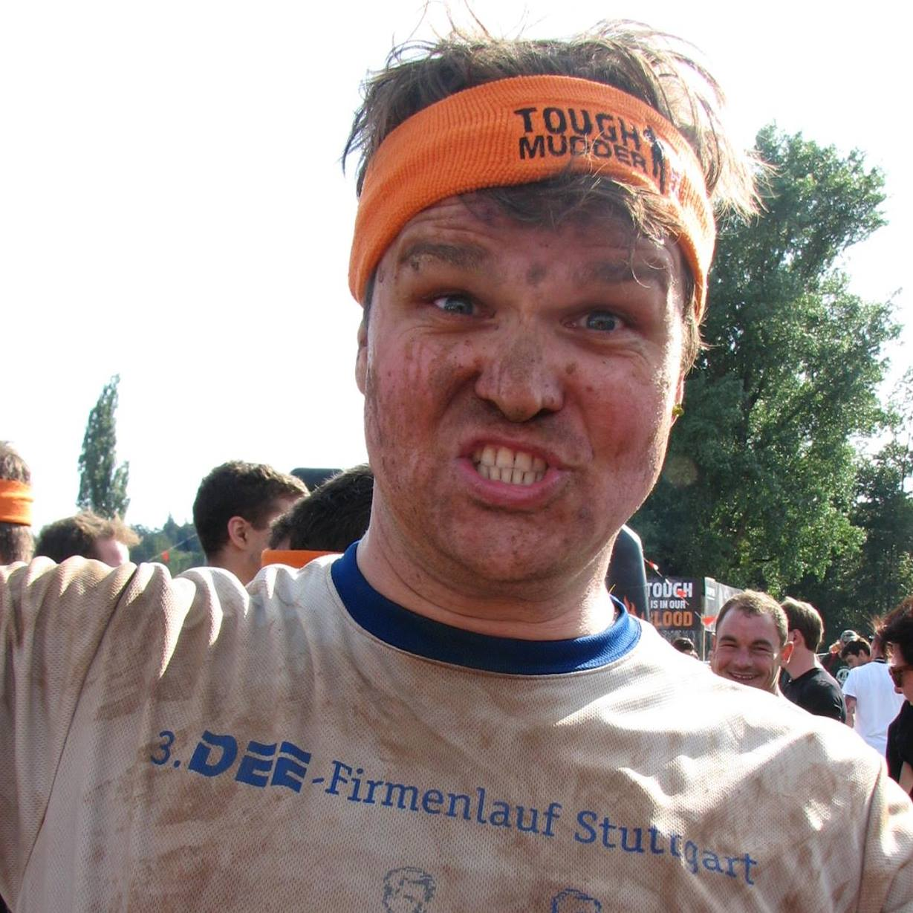
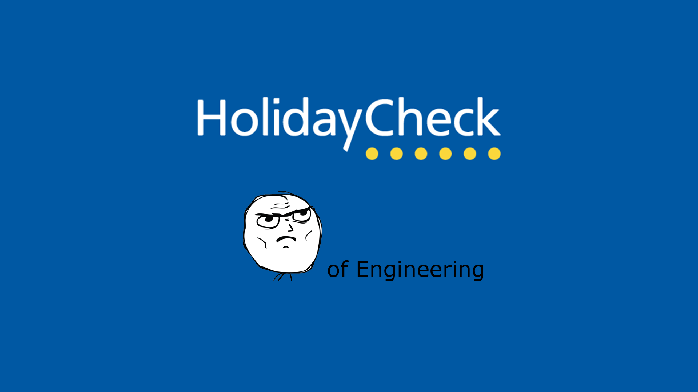
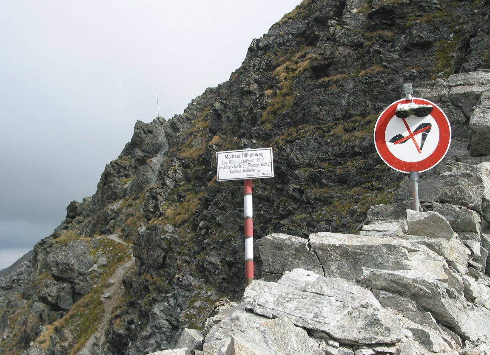
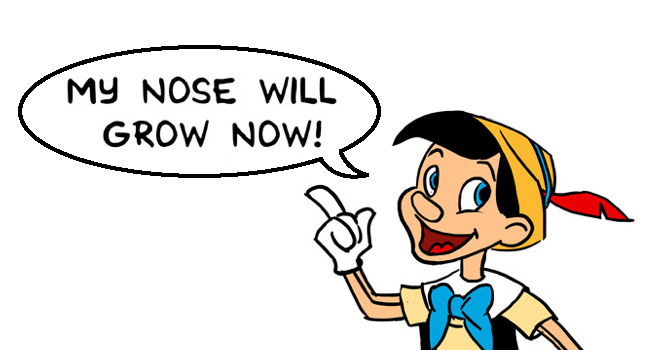
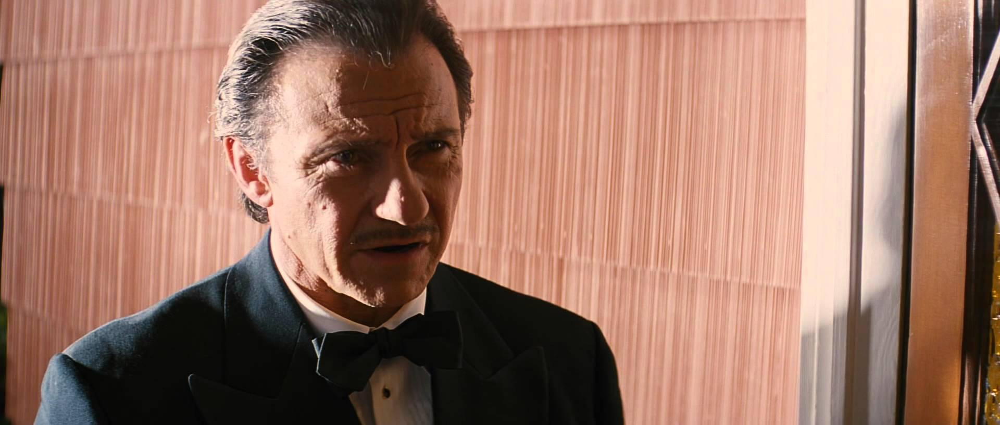
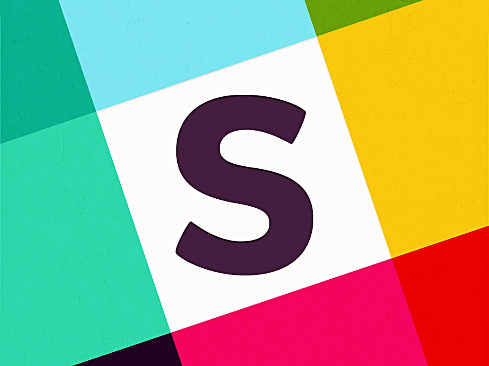
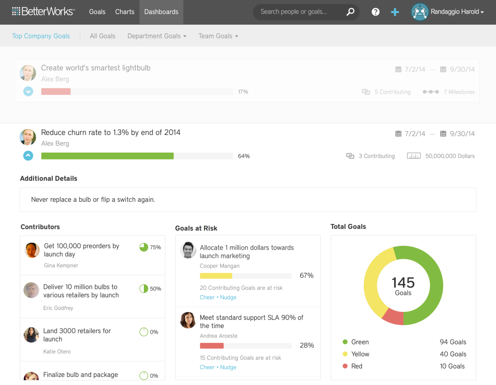
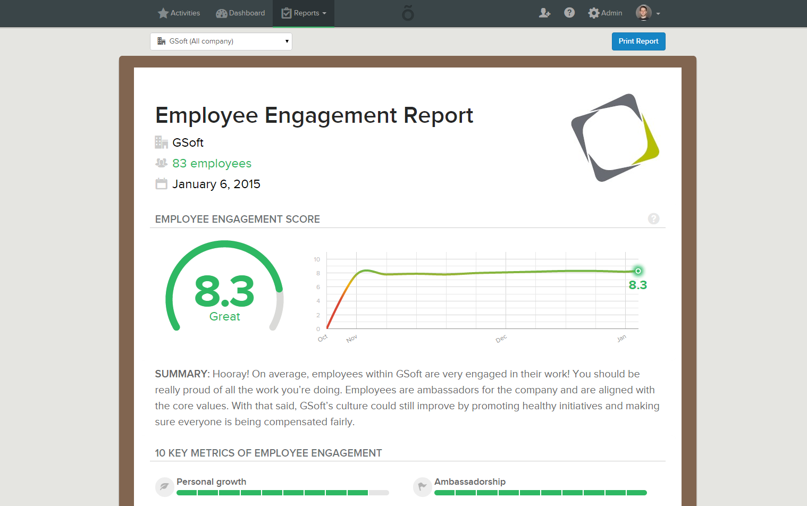

# [fit]Confessions of an 
# [fit]ALM

---

# About me

### Björn Zapadlo
### Constance
### 37 years
### Running / Photography

---

---

#CONTACT ME
bjoern.zapadlo@gmail.com

http://www.zapadlo.de

@BjoeZap

https://www.xing.com/profile/Bjoern_Zapadlo

http://de.linkedin.com/pub/bjoern-zapadlo/36/889/1a5

---

# [fit]#won'tTell
1. Management 3.0
1. That works for everybody
1. Truth

^ No truth just my opinion

---

# [fit]Agenda  
##ALM... WTF?
##Why?
##How?

^ Additionally you will know why I have to run so much ;)

---

# [fit] ALM
# [fit] ...WTF

---

# [fit] Agile
# [fit] Line
# [fit] Manager

---

--- 

# [fit] Agile  
# [fit] doesn't need
# [fit] Management!

---

# [fit] But
# ...a bit at least

^ People are satisfied => show later how I measure this
< 5% Fluctuation / average time people stay with holidaycheck 4 years
People have a demand for being lead and getting feedback
Today I will try to show you reasons for it and how I think this can be done

---

# [fit] What 
# [fit] I do?

---

english.png)

---

# I do not tell my employees **WHAT TO DO** and **HOW TO DO IT**

---

## Lead 30 people (Devs & SMs)
## Recruiting
## Personal development
## Peer for architecture on request
## Consulting e.g. for OKRs
## Conferences / Trainings

---

# The right people sit at the right time at the right table

---

# I solve problems

---

# Ergo
### Less management
## More leadership

---

# [fit] Why
# ...my beliefs

---

# [fit] Empowerment

^ For Teams and also for me
Basis for driving decisions

---

## “Experience is simply the name we give our mistakes.” 

## *Oscar Wilde*

^ Mistakes are okay even more they are important to learn

---

# [fit] Honesty 
# [fit] & 
# [fit] Transparency

^ Basis
If something does not work / fit one has to talk about it to fix it
Let people at least know the reasons behind a decision
Example of transparency:
People know where I am => Office monitor
Daily rates of freelancers => knowing the reasons
Setting clear goals but not paying a bonus dependend on the goals

---

# [fit] Flat hierarchy

^ 
hierarchy hinders honesty, transparency and speed => example with architectural proposals

---

# [fit] Authenticity

^ I am me
It is okay to be grumpy sometimes
It is okay to to be 100% behind a decision from above
There is a role of HoE but it is filled with me as a person

---

# [fit] Trust

^ THe foundation of collaboration
I hire people I trust
Without trust collaboration is not possible
handover => cooperation => collaboration
Bulding trust => find similarities => canon example

---

## “The best way to find out if you can trust somebody is to trust them.” 

## *Ernest Hemingway*

---

# [fit] Leap of faith

^ Core task of a supervisor
Has to be done again and again
Right from the start

---

# [fit] ~~Change~~
# [fit] ~~people~~

---

# [fit]B = f(P,E)
^ Behaviour = function(Personality, Environment)

---

# The only one I can change is me

^ Different people have to be treated differently at different points in time

---

# [fit] Escalation

^ The disciplinary whip is always the last level but sometimes people need to get a straight call by their supervisor

---

# [fit] Empathy

^ Imho the most important skill in interaction with people
In addition the leads hopefully to adapting your way of interaction to your opposite
mastery: level 1 read the feelings, level 2 adjust your behaviour

---

# [fit]vs. Scrum Master

^ ONE team
Focus of Scrum Master is the team
ALM's focus are the individuals
Together they work to tackle Company imediments, improvements and agile transformation
But for teams I like to know about conflicts. I will just act if I am asked for help not before. Reason: to be able to defend

---

# [fit] Passion

^ Fun is one of the sources of passion
People like to have fun & entertainment
Topic content also a factor but often less important
the bottom line of agility is will and passion
events work to provide fun

---

# [fit] How
# My tools

---

# [fit] Coffee

^ Normally the kitche is the place for rumors, feelings and news
Flurfunk aka Hallway radio
With single people and groups
2 - 3 times a day

---

# [fit] Team Lunches

^ The whole product team incl. all roles is invited
Once a quarter
Talk about problems, milestones, technical stuff, private stuff, ...
People feel esteemed
No fixed agenda

---

# [fit] After work beer

^ Spontaneous => announce in kitchen, office, ...
Self-payed
Planned and payed 
Spontan => Bei Gemba walk annonuncen 
Free for all => also other departments => normally they really talk about business stuff

---

# [fit] Candy Store

^ Storage container in my office with sweets
People from different departments come along and often there is a little chat
Also good to bring the sweets directly to the teams if they did something good or if there is bad mood

---

# [fit] Dinner
^ Manche Leute brauchen diesen Kontakt
Erfahrung: Oft 3 Stunden nur über die Arbeit gesprochen
Wird als große Wertschätzung empfunden
Schöne Gegenleistung für Extraleistung

---

# [fit] Now you know why I have to run so much

---

# [fit] Gemba walk

^ ca. 15 min am Tag
Rein schauen, was die Leute so machen
Ein Witz / Spruch
Feel the atmosphere
Really valuable invest

---

# [fit]Recruiting

^ 2 stufiger Prozess: Skype & Face 2 Face
Direkt am Anfang jemand aus dem Team dabei
Teams entscheiden
Hire 4 will not skill
Bei Zweifeln nicht einladen

---

# [fit] Monthlys

^ Formales Gespräch alle 4 Wochen
ersetzt nich das normale spontane Gespräch
Wie fühlt sich der MA
Manchmal auch nur 5 min

---

^ Zentrales Entwickler Tool zur Kommunikation
Zu viel!!!
Viel Eskalation

---

^ Dokumentation für alle 1:1
Planung meines Tages / Woche
Alles sofort auf eine Liste

---

# [fit] OKRs

^ Transparency
Focus
Purpose
Overhead
Hard to master
Do not couple with a bonus
(nearly) vverything could be covered by OKRs

---

^ Betterworks
^ Halb geil

---

# [fit] Feedback

---

# [fit] Moving
# [fit] Motivators

---

# Wer hat letztes Jahr eine Mitarbeiterumfrage gemacht?

---

# [fit] Wer misst, misst Mist!*
## * Who measures measures rubbish! 

^ Meist zu lange Abstände
Anonymität ist super wichtig
Aufwendig
Schrödinger goes survey
Meist optimiert sich ein System auf das System

---

# [fit] Officevibe

^ SAAS
Fragen werden gestellt
Auswertungen sehr gut
Vergleich von verschiedenen Gruppen
Mehrere KPIs
Feedback

---

# [fit] Delegation

^ Basis von allem => Sonst wäre ich nicht in der Lage zu arbeiten
Delegation Board
Hängt vom Team ab

---

# [fit] Imropvements

^ Dailies aller Teams zu besuchen
Bei den Teams sitzen

---

