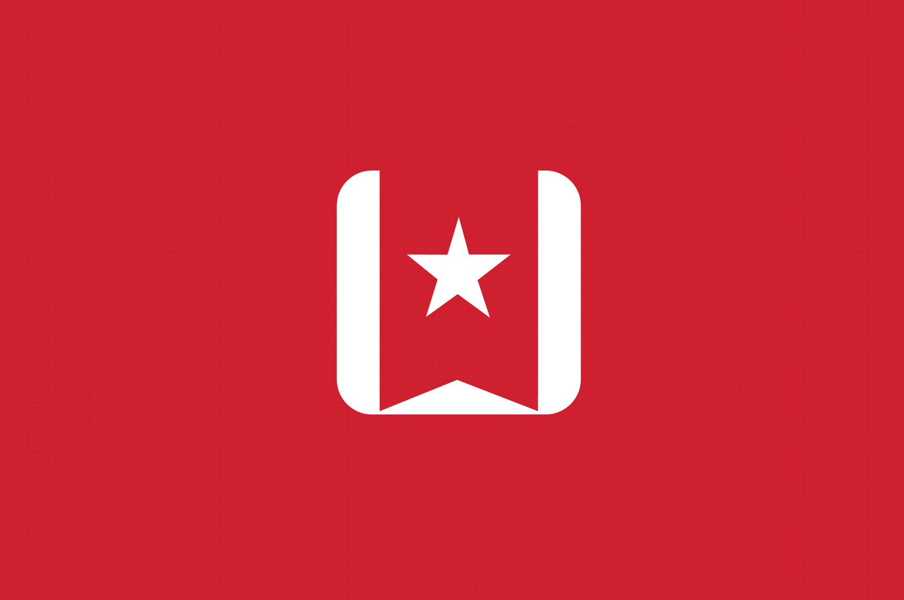

# [fit]Confessions of an 
# [fit]ALM

---

# About me

### Björn Zapadlo
### Konstanz
### 37 Jahre
### Laufen / Fotografie

---

#CONTACT ME
bjoern.zapadlo@gmail.com

http://www.zapadlo.de

@BjoeZap

https://www.xing.com/profile/Bjoern_Zapadlo

http://de.linkedin.com/pub/bjoern-zapadlo/36/889/1a5

---

# [fit] SeeIT
# [fit] IT Meetup in Konstanz / Kreuzlingen

---

# [fit]#nichtThemaHeute
1. Management 3.0
1. Das funktioniert für alle
1. Wahrheit

^ Keine Wahrheit sondern nur Meinung

---

# [fit]Agenda  
##ALM... WTF?
##Warum?
##Was?

---

# [fit] ALM
# [fit] ...WTF

---

# [fit] Agile
# [fit] Line
# [fit] Manager

---

--- 

# [fit] Agile  
# [fit] braucht kein
# [fit] Management!

---

# [fit] Doch
# ...ein bisschen

^ Leute sind zufrieden
< 5% Fluktuation
Leute wollen manchmal ein wenig Führung und Feedback
Warum und wie sage ich euch heute

---

# [fit] Was mache 
# [fit] ich denn?

---

.png)

---

# Ich sage meinen Angestellten nicht, **WAS** sie **WIE** zu machen haben.

---

## 30 Leute führen (Devs & SMs)
## Recruiting
## Weiterentwicklung
## Peer für Architektur auf Nachfrage
## Conferences / Trainings

---

# Die richtigen Leute zur richtigen Zeit am richtigen Tisch

---

^ Probleme lösen

---

# Ergo
### Weniger Management
## Mehr Leadership

---

# [fit] Warum
# ...an was ich glaube

---

# [fit] Empowerment

^ Für Teams und auch für mich
Fehler machen ist okay
Entscheidungen treffen

---

# [fit] Ehrlichkeit 
# [fit] & 
# [fit] Transparenz

^ Basis
Wenn was nicht passt, muss es angesprochen werden
Es ist okay ein Ziel nicht zu erreichen
Beispiel: Tagessätze externe Firma an Team => die wollen die Gründe verstehen
Ziel != Bonus

---

# [fit] Flache Hierarchie

^ Hierarchie verhindert Ehrlichkeit
Hierarchie verhindert Transparenz
Hierarchie verhindert Geschwindigkeit

---

# [fit] Authentizität

^ Ich bin ich

---

# [fit] Vertrauen

^ Die Basis von allem

---

## “Vertrauen ist das Gefühl, einem Menschen sogar dann glauben zu können, wenn man weiss, dass man an seiner Stelle lügen würde.” 

## *Henry Louis Mencken*

---

# [fit] Vertrauensvorschuss

^ Kernaufgabe einer FK
Immer wieder

---

# [fit] ~~Menschen~~
# [fit] ~~ändern~~

---

# [fit]V = f(P,U)
^ Verhalten = funktion(Persönlichkeit, Umwelt)

---

# [fit] Eskalation

^ Die disziplinarische Peitsche ist immer schlecht, aber manchmal eben nötig

---

# [fit] Empathie

^ Extrem wichtiger Skill im Umgang mit Menschen
Mgmt Stil an den Mitarbeiter anpassen

---

# [fit]vs. Scrum Master

^ Ein Team
Scrum Master fokussiert auf das Team
ALM fokussiert auf die Individuen
Zusammen in Richtung Company Improvement

---

# [fit] Passion

^ Spaß erzeugt Passion
Leute wollen gute Laune & Entertainment
Organisation von Events
Agilität hat was mit Wollen & Passion zu tun

---

# [fit] Was
# Meine Tools

---

# [fit]Recruiting

^ 2 stufiger Prozess: Skype & Face 2 Face
Direkt am Anfang jemand aus dem Team dabei
Teams entscheiden
Hire 4 will not skill
Bei Zweifeln nicht einladen

---

# [fit] Monthlys

^ Formales Gespräch alle 4 Wochen
ersetzt nich das normale spontane Gespräch
Wie fühlt sich der MA
Manchmal auch nur 5 min

---

# [fit] Kaffee

^ Küche ist der Place to be um Gerüchte und Gefühle aufzuschnappen
Mit versch Leuten am Tag

---

# [fit] Team Lunches

^ Das ganze Produkt Team ist eingeladen
Team Probleme ansprechen
Wertschätzung
Keine echte Agenda
Alle 6 Wochen

---

# [fit] Gemba walk

^ ca. 15 min am Tag
Rein schauen, was die Leute so machen
Ein Witz / Spruch

---

# [fit] Feierabend Bier

^ Spontan => Bei Gemba walk annonuncen 
Geplant
Über Abteilungsgrenzen hinaus

---

# [fit] Candy Store

^ Leute kommen vorbei => Verschiedene Abteilungen
Open Office

---

# [fit] Dinner
^ Manche Leute brauchen diesen Kontakt
Erfahrung: Oft 3 Stunden nur über die Arbeit gesprochen
Wird als große Wertschätzung empfunden
Schöne Gegenleistung für Extraleistung

---

^ Zentrales Entwickler Tool zur Kommunikation
Zu viel!!!
Viel Eskalation

---

^ Dokumentation für alle 1:1
Planung meines Tages / Woche
Alles sofort auf eine Liste

---

# [fit] OKRs

^ Transparenz
Purpose
Overhead
Schwierig => Hard to master
Bonus doof

---

^ Betterworks
^ Halb geil

---

# [fit] Feedback

---

# Wer hat letztes Jahr eine Mitarbeiterumfrage gemacht?

---

# [fit] Wer misst, misst Mist!

^ Meist zu lange Abstände
Anonymität ist super wichtig
Aufwendig
Meist optimiert sich ein System auf das System

---

# [fit] Officevibe

^ SAAS
Fragen werden gestellt
Auswertungen sehr gut
Vergleich von verschiedenen Gruppen
Mehrere KPIs
Feedback

---

# [fit] Delegation

^ Basis von allem => Sonst wäre ich nicht in der Lage zu arbeiten
Delegation Board
Hängt vom Team ab

---

# [fit] Das geht auch 
# [fit] besser

^ Dailies aller Teams zu besuchen
Bei den Teams sitzen

---

