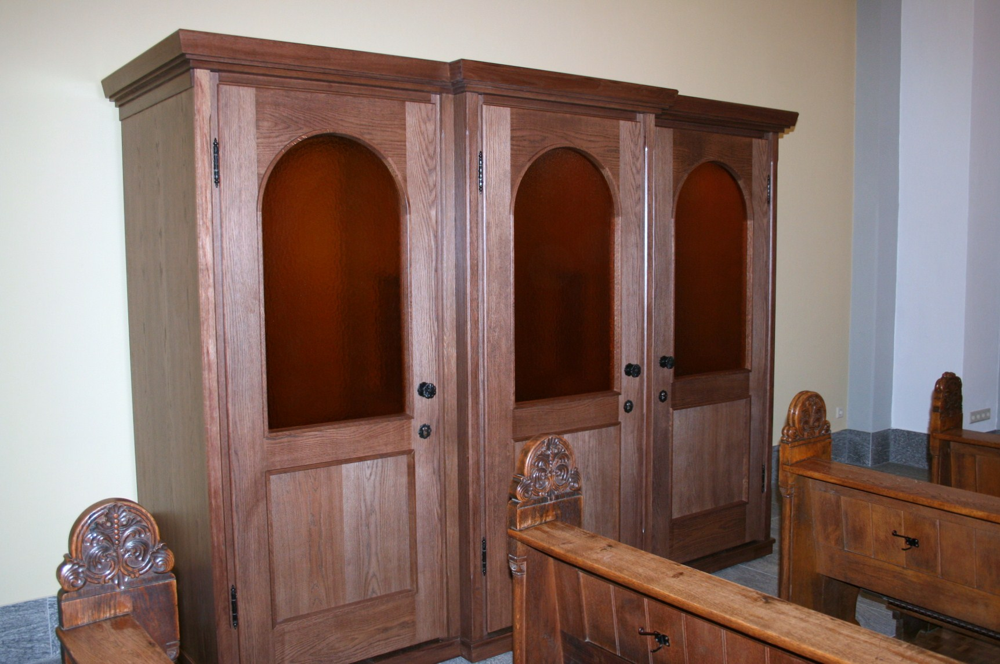

# [fit]Confessions of an 
# [fit]ALM

---

# About me

### Björn Zapadlo
### Constance
### 37 years
### Running / Photography

---

---

#CONTACT ME
bjoern.zapadlo@gmail.com

http://www.zapadlo.de

@BjoeZap

https://www.xing.com/profile/Bjoern_Zapadlo

http://de.linkedin.com/pub/bjoern-zapadlo/36/889/1a5

---

# [fit]#won'tTell
1. Management 3.0
1. That works for everybody
1. Truth

^ No truth just my opinion

---

# [fit]Agenda  
##ALM... WTF?
##Why?
##How?

^ Additionally you will know why I have to run so much ;)

---

# [fit] ALM
# [fit] ...WTF

---

# [fit] Agile
# [fit] Line
# [fit] Manager

---

^ That sounds paradox

--- 

# [fit] Agile  
# [fit] doesn't need
# [fit] Management!

---

# [fit] But
# ...a bit at least

^ People are satisfied => show later how I measure this
< 5% Fluctuation / average time people stay with holidaycheck 4 years
People have a demand for being lead and getting feedback
Today I will try to show you reasons for it and how I think this can be done

---

# [fit] What 
# [fit] I do?

---

english.png)

---

# I do not tell my employees **WHAT TO DO** and **HOW TO DO IT**

^ Why?
I am the least to know about software architecture / programming languages / ...

---

### Lead 32 people (Devs & SMs)
### Recruiting
### Personal development
### Peer for architecture on request
### Consulting e.g. for OKRs
### Conferences / Trainings

---

# The **right people** sit at the **right time** at the **right table**

---

# I solve problems

^ Uber Scrum Master
Department / Company Level
Also individuals

---

# Ergo
### Less management
## More leadership

---

# [fit] Why
# ...my beliefs

---

# [fit] Empowerment

^ For Teams and also for me
Basis for driving decisions

---

## “Experience is simply the name we give our mistakes.” 

## *Oscar Wilde*

^ Mistakes are okay even more they are important to learn

---

# [fit] Honesty 
# [fit] & 
# [fit] Transparency

^ Basis
If something does not work / fit one has to talk about it to fix it
Let people at least know the reasons behind a decision
Example of transparency:
People know where I am => Office monitor
Daily rates of freelancers => knowing the reasons
Setting clear goals but not paying a bonus dependend on the goals

---

# [fit] Flat hierarchy

^ hierarchy hinders honesty, transparency and speed => example with architectural proposals

---

# [fit] Authenticity

^ I am me
It is okay to be grumpy sometimes
It is okay to to be 100% behind a decision from above
There is a role of HoE but it is filled with me as a person

---

# [fit] Trust

^ The foundation of collaboration
I hire people I trust. If you do not trust people you should not hire people.
Without trust collaboration is not possible
handover => cooperation => collaboration
Bulding trust => find similarities => canon example

---

## “The best way to find out if you can trust somebody is to trust them.” 

## *Ernest Hemingway*

---

# [fit] Leap of faith

^ you have to give an advance in trust
Core task of a supervisor
Has to be done again and again
Right from the start

---

# [fit] ~~Change~~
# [fit] ~~people~~

---

# [fit]B = f(P,E)
^ Behaviour = function(Personality, Environment)

---

# I can only change 3 people:
# me, myself & I

^ Different people have to be treated differently at different points in time

---

# [fit] Escalation

^ The disciplinary whip is always the last level but sometimes people need to get a straight call by their supervisor

---

# [fit] Empathy

^ Imho the most important skill in interaction with people
In addition the leads hopefully to adapting your way of interaction to your opposite
mastery: level 1 read the feelings, level 2 adjust your behaviour

---

# [fit]vs. Scrum Master

^ ONE team
Focus of Scrum Master is the team
ALM's focus are the individuals
Together they work to tackle Company imediments, improvements and agile transformation
But for teams I like to know about conflicts. I will just act if I am asked for help not before. Reason: to be able to defend / tell it is under control

---

# [fit] Passion

^ Fun is one of the sources of passion
People like to have fun & entertainment
Topic content also a factor but often less important
the bottom line of agility is will and passion
events work to provide fun

---

# [fit] How
# My tools

---

# [fit] Coffee

^ Normally the kitche is the place for rumors, feelings and news
Flurfunk aka Hallway radio
With single people and groups
2 - 3 times a day

---

# [fit] Team Lunches

^ The whole product team incl. all roles is invited
Once a quarter
Talk about problems, milestones, technical stuff, private stuff, ...
People feel esteemed
No fixed agenda

---

# [fit] After work beer

^ Spontaneous => announce in kitchen, office, ...
Self-payed
Planned and payed 
Spontan => Bei Gemba walk annonuncen 
Free for all => also other departments => normally they really talk about business stuff

---

# [fit] Candy Store

^ Storage container in my office with sweets
People from different departments come along and often there is a little chat
Also good to bring the sweets directly to the teams if they did something good or if there is bad mood

---

# [fit] Dinner
^ My experience: Some of my employees value this kind of contact. Approx. 20% of mine.
Of a dinner of 4 hours normally we talk 3h about work related stuff.
People feel extremly esteemed by this
Downside might be that others become envy
Also this is a really good return of invest for performance
No recurring appointment. On demand.

---

# [fit] Now you know 
# [fit] why I have to run

---

# [fit] Gemba walk

^ approx. 15 - 30 min per day
just step in the office and look what people are doing and how they look
Saying something funny or asking a question "Everything is okay" 
Feel the atmosphere
Really valuable invest

---

# [fit]Recruiting

^ 2-step process
Jedi program => other department
Values / focus on soft skill
Right at the beginning someone from the team is present
2. step => just with the potential team
the team decides
hire for will and not for skill
if in doubt we will no proceed

---

# [fit] Monthlys

^ formal talk every 4 weeks
concentrated on Mondays
does not replace spontaneous talks
Focus: how does the employee feel => impediments
Less on what he is doing
Documentation by wunderlist
30 minutes are blocked, sometime just 5 minutes

---

^ Documentation of my 1:1s / Team Meetings
Planning my day / week
Putting everything instantly on the list even a 5 min task => not to forget it
Yes, I am using Outlook too ;)
Everthing that has a fixed date I move to an Outlook appointment
Measure of my work => > 2000 Tasks a year

---

^ first choice of communication for our developers
many integrations into our tool landscape
Too much
Plenty of escalation because of non verbal communication => you have to have an eye on this and sometimes even encourage people to use private channels or evenn better to talk in face to face

---

# [fit] OKRs

^ Transparency, Focus, Purpose
Feels like overhead => imho it's not
Hard to master => we are doing it for more than one year and still it feels not good
Formulation
Value driven aka outcome
break down of metrics
people think in tasks => OKRs are not a project planning tool
Less is more
Do not couple with a bonus
(nearly) everything could be covered by OKRs
Not achieving is okay => 70% mindeset seems to be hard

---

^ Betterworks
Works okayish
Better than not having a tool

---

# [fit] Moving
# [fit] Motivators

^ Accept that people have different motivations
Even if you do not understand it
I do not do this with my employees directly with cards
I use it for me to find out what I think motivates them
Then try to verify this in 1:1s

---

# [fit] Feedback

---

# Who has done an employee survey last year?

^ How often? => 1, 2, > 3

---

# [fit] Wer misst, misst Mist!*
## * Who measures measures rubbish! 

^ What was the outcome? => Hard to tell => variation
What actions were taken? => often none after the first survey
It is expensive to do so
Lots of effort to prepare and get insights => Excel vodoo magic
It sucks to fill out a 30 page form
The frequency is too low
People complain about recent things not about stuff that happend 3 months ago
Beeing anonymous is super important

---

# [fit] Officevibe

^ SAAS
Provided questions which are mostly quite good
Different KPIs / categories e.g. relationship with colleagues / manager
Nice charts ;)
group comparison => gamification
Feedback => anonymous and not anonymous

---

# [fit] Delegation

^ Foundation of my style of work => too many people and I am lazy
Deleagtion board on request => not upfront
Depends on the maturity of the team

---

# [fit] Improvements

^ Visit the dailies of my teams more recently
Spend time in the team rooms

---

